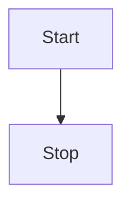
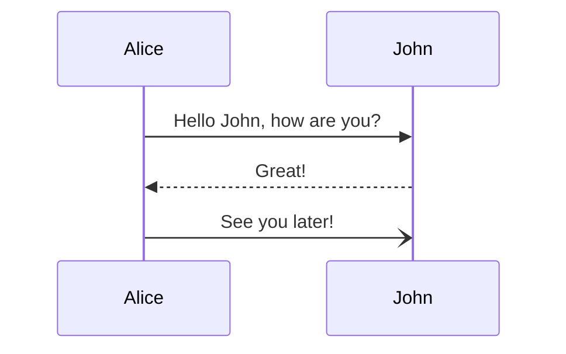
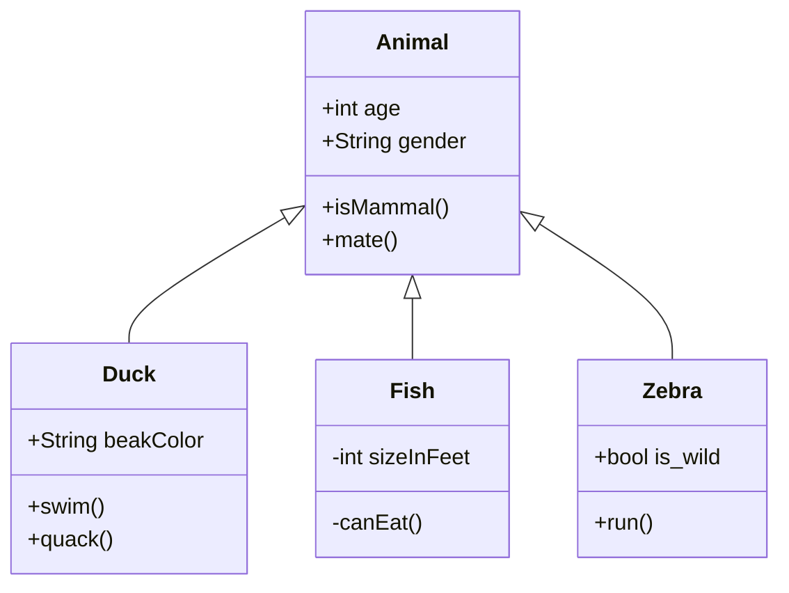
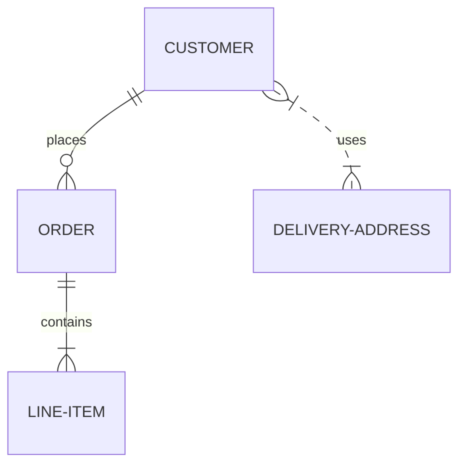

# :triangular_flag_on_post: Diagram

## Flow chart

```mermaid
graph TD
Start --> Stop
```
  

## Sequences diagram

```mermaid
sequenceDiagram
Alice->>John: Hello John, how are you?
John-->>Alice: Great!
Alice-)John: See you later!
```
  

## Class diagram

```mermaid
classDiagram
Animal <|-- Duck
Animal <|-- Fish
Animal <|-- Zebra
Animal : +int age
Animal : +String gender
Animal: +isMammal()
Animal: +mate()
class Duck{
+String beakColor
+swim()
+quack()
}
class Fish{
-int sizeInFeet
-canEat()
}
class Zebra{
+bool is_wild
+run()
}

```
  

## State diagram

```mermaid
erDiagram
CUSTOMER ||--o{ ORDER : places
ORDER ||--|{ LINE-ITEM : contains
CUSTOMER }|..|{ DELIVERY-ADDRESS : uses
```